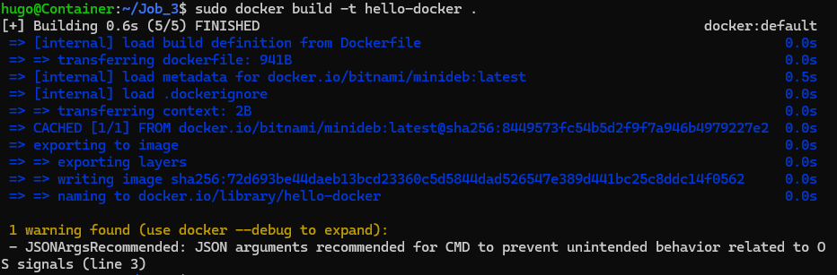
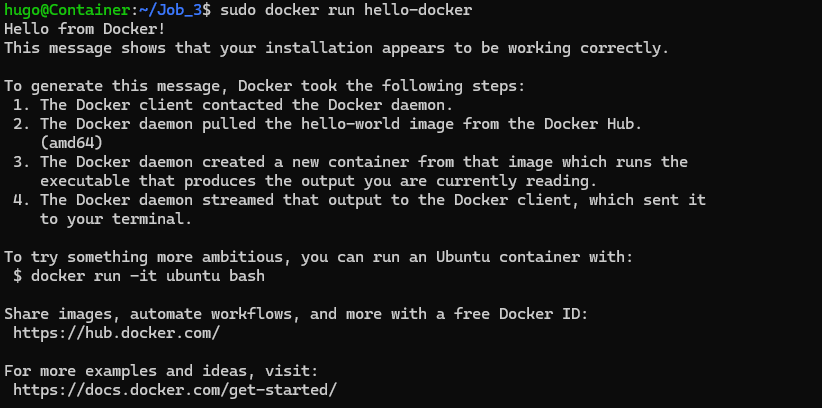

# Recréer le conteneur hello-wolrd
## Créer le Docker file
Dans votre dossier home/user crer un dossier pour le projet :
```
mkdir hello-docker
```
Créer le ficher Dockerfile :
```
vi /home/user/hello-docker/Dockerfile
```
Contenu du fichier :
```
# Importer l'os minimal debian
FROM bitnami/minideb:latest

# Appel de la commade echo avec le texte à afficher
CMD echo "Hello from Docker!\n\
This message shows that your installation appears to be working correctly.\n\
\n\
To generate this message, Docker took the following steps:\n\
 1. The Docker client contacted the Docker daemon.\n\
 2. The Docker daemon pulled the "hello-world" image from the Docker Hub.\n\
    (amd64)\n\
 3. The Docker daemon created a new container from that image which runs the\n\
    executable that produces the output you are currently reading.\n\
 4. The Docker daemon streamed that output to the Docker client, which sent it\n\
    to your terminal.\n\
\n\
To try something more ambitious, you can run an Ubuntu container with:\n\
 $ docker run -it ubuntu bash\n\
\n\
Share images, automate workflows, and more with a free Docker ID:\n\
 https://hub.docker.com/\n\
\n\
For more examples and ideas, visit:\n\
 https://docs.docker.com/get-started/"
 ```
## Créer le container
```
# Se déplacer dans le fichier du Dockerfile
cd /home/user/hello-docker

# Créer le conteneur le nommer "hello-docker" à partir du Dockerfile dans le fichier où vous êtes.
sudo docker build -t hello-docker .
```
Réponse :

## Lancer le conteneur
```
sudo docker run hello-docker
```
Réponse :

