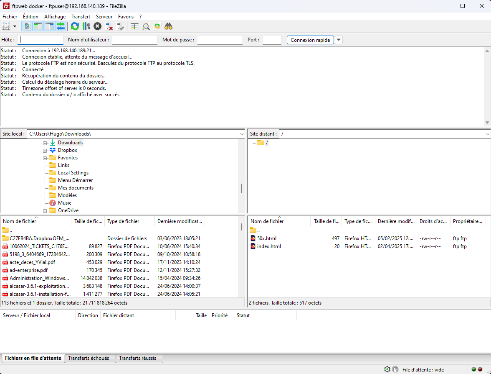

# Nginx et FTP
## Installer docker compose
Si ce n'est pas déja fait installer Docker compose
```
sudo apt-get update
sudo apt-get install docker-compose-plugin
```
## Créer le fichier docker compose 
Pour construire deux conteneurs reliés au même volume, Docker Compose est parfaitement adapté à ce besoin.  
Contenu du fichier docker-compose.yml
```
version: '2.34'

services:
  web:
    images: nginx:latest
    ports:
      - "80:80"
    volumes:
      - site_web:/usr/share/nginx/html

  ftp:
    image: fauria/vsftpd
    ports:
      - "21:21"
      - "20:20"
      - "21100-21110:21100-21110"
    volumes:
      - site_web:/home/vsftpd/ftpuser
    environement:
      - FTP-USER=ftpuser
      - FTP_PASS=monpassword
      - PASV_ADDRESS=HostAddress
      - PASV_MIN_PORT=21100
      - PASV_MAX_PORT=21110
volumes:
  site_web:
    name: ftpweb
```
### Lancez les conteneurs
```
sudo docker-compose up -d
```
### Vérifier que les les conteneurs sont bien en cours d'exécution
```
sudo docker-compose ps
```
### Vérifier que votre volume a bien éré créer
```
sudo docker volume ls
```
## Connection avec FileZilla
Depuis une autre machine sur le même réseau.  
Ouvrir FileZilla.  
Lancer une connection avec l'adresse Ip de la machine hote du conteneur docker sur le port 21.  
Puis déplacer le fichier index.html depuis votre machine vers le volume docker.  
  
  
## Confirmation
Le fait d'upload un nouveau fichier index dans le volume via ftp, change la page d'accueil du server web nginx.