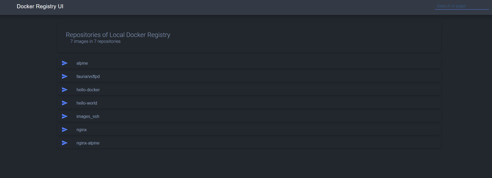

# Registry
## Mise en place d'un registry local
Le plus simple est d'utiliser une image docker officielle "registry":
```
docker run -d -p 5000:5000 --name registry registry:2
```
## Utilisation du registry local
### Tagger les images existantes
On utilise une boucle
```
for images in nginx-alpine images_ssh hello-docker alpine nginx hello-world fauria/vsftpd; do sudo docker tag $images:latest localhost:5000/$images:latest; done
```
### Pousser l'image vers le registry
On utilise encore une boucle
```
for images in nginx-alpine images_ssh hello-docker alpine nginx hello-world fauria/vsftpd; do sudo docker push localhost:5000/$images:latest; done
```
### Tirer une image depuis votre registry
```
sudo docker pull localhost:5000/mon-image:latest
```
## Création d'une interface web
### Utiliser Docker Registry UI
On utilisera un projet open-source comme docker-registry-ui :
```
sudo docker run -d -p 8880:80 --name registry-ui --link registry -e REGISTRY_URL=http://registry:5000 joxit/docker-registry-ui:latest
```
# Finalement on peut faire un docker compose
Le docker compose permet de déployer les deux conteneurs sur le même réseau et de les configurer en même temps.
## Docker-compose.yml
Dans un nouveau dossier dédier au projet créer le fichier suivant :
```
version: '3.8'

services:
  registry:
    image: registry:2
    container_name: registry
    ports:
      - "5000:5000"
    environment:
      REGISTRY_HTTP_HEADERS_Access-Control-Allow-Origin: '["http://192.168.140.189:8080"]'
      REGISTRY_HTTP_HEADERS_Access-Control-Allow-Methods: '["HEAD", "GET", "DELETE", "PUT"]'
      REGISTRY_HTTP_HEADERS_Access-Control-Allow-Credentials: '[true]'
      REGISTRY_HTTP_HEADERS_Access-Control-Allow-Headers: '["Authorization", "Accept", "Content-Type"]'
    volumes:
      - registry-data:/var/lib/registry
    restart: always

  registry-ui:
    image: joxit/docker-registry-ui:latest
    container_name: registry-ui
    ports:
      - "8080:80"
    environment:
      - REGISTRY_TITLE=Local Docker Registry
      - REGISTRY_URL=http://192.168.140.189:5000
      - REGISTRY_ALLOW-DELETE=true
      - SINGLE-REGISTRY=true
      - DELETE_IMAGES=true
    depends_on:
      - registry
    restart: always

volumes:
  registry-data:
```
Une fois les images taggé et poussé sur le registry elle sont disponible dans l'interface graphique :  
